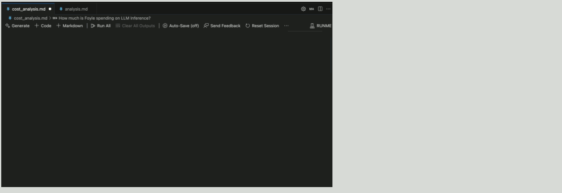

---
runme:
  id: 01HWC3HJZE75PN5S3A6VTJ2XR0
  version: v3
---

# Foyle

## What Is Foyle

Foyle is a copilot that works with VSCode Notebooks. As you describe your intent in a markup
cell, Foyle suggests code cells containing commands you can run to achieve that intent.



Foyle is primarily intended to help software engineers operate their applications. Foyle simplifies
software operations by removing the need to remember complex commands. Developers can just
describe their intent in natural language and Foyle will suggest the commands to run.

Since Foyle is integrated into VSCode Notebooks, Foyle provides a single UI for interacting with LLMs
and executing suggested commands. 

As you execute commands, Foyle learns how to predict those commands given the cells preceding them.
This allows Foyle to provide more accurate suggestions over time.

## Quickstart

### Installation

1. Download the latest release from the [releases page](https://github.com/jlewi/foyle/releases)

   * On Mac you may need to remove the quarantine attribute from the binary
   
     ```bash
      xattr -d com.apple.quarantine /path/to/foyle
     ```

1. Configure your OpenAPI Key
  
   ```
   foyle config set openai.apiKeyFile=/path/to/openai/apikey
   ```

1. Start the Foyle server

   ```
   foyle serve
   ```

1. Open VSCode and install the [Runme extension](https://docs.runme.dev/installation/vscode)


1. Inside VSCode configure Runme to use Foyle

   1. Open the VSCode setting palette
   2. Search for `Runme: Ai Base URL`
   3. Set the address to `http://localhost:${HTTP_PORT}/api`
      * The default port is 8877

### Try It Out

1. Inside VSCode Open a markdown file or create a notebook; this will open the notebook inside Runme

   * Refer to [Runme's documentation](https://docs.runme.dev/installation/installrunme#full-display-of-runmes-action-on-a-markdown-file-in-vs-code) for a walk through
      of Runme's UI
   * If the notebook doesn't open in Runme
      1. right click on the file and select "Open With"
      2. Select the option "Run your markdown" to open it with Runme

1. You can now add code and notebook cells like you normally would in vscode

1. As you edit markup cells Foyle will suggest code cells you can run to achieve the intent described in the markup cell
    
## Documentation

Documentation is available at [https://foyle.io](https://foyle.io)

## Feedback

If you have questions or run into bugs please open a GitHub issue in the [Foyle repository](https://github.com/jlewi/foyle/issues).