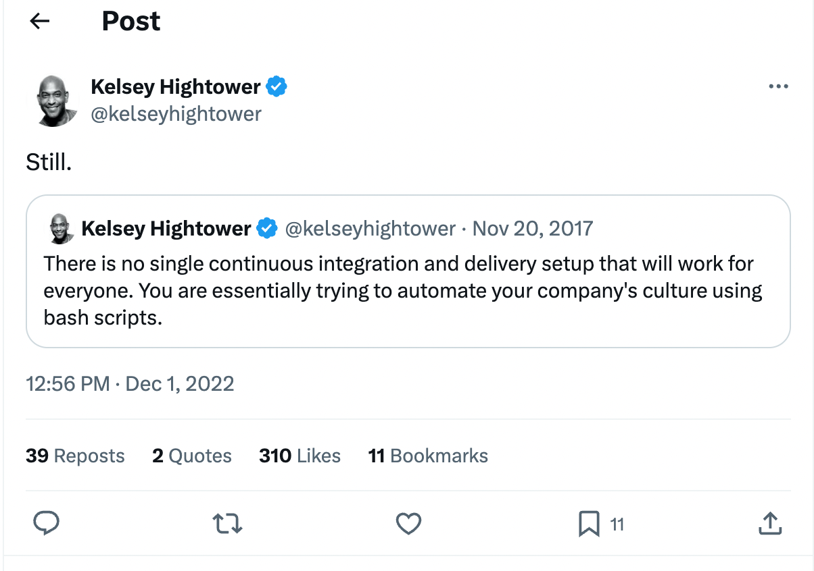

---
runme:
  id: 01HWC3HJZE75PN5S3A6VTJ2XR0
  version: v3
---

# Foyle

## Quickstart

Follow the [Getting Started Guide](https://foyle.io/docs/getting-started/)

## Docs

Documentation is available at [https://foyle.io](https://foyle.io)

## Overview

Foyle is a project aimed at building agents to help software developers
deploy and operate software. The key premise of foyle is that better data
is the key to building better agents. To enable that foyle aims to change
how SWE's interact with their infrastructure so as to facilitate collecting
the data necessary to build agents.

Foyle aims to move software operations out of the shell and into a literate
environment. In particular, Foyle uses vscode notebooks to let users
interact with their infrastructure. This is achieved using a [VSCode Notebook Controller](https://code.visualstudio.com/api/extension-guides/notebook#controller) which executes cells
containing shell commands by using a simple API to send them to a server capable of executing them.

The goal of foyle is to use this literate environment to collect two types of data
with the aim of building better agents

1. Human feedback on agent suggestions
2. Human examples of reasoning traces

## Human feedback

We are all asking AI's (ChatGPT, Claude, Bard, etc...) to write commands to perform
operations. These AI's often make mistakes. This is especially true when the correct answer depends on internal
knowledge which the AI doesn't have.

Consider a simple example, lets ask ChatGPT

```sh {"id":"01HWC3HJZE75PN5S3A6P09NM0J"}
What's the gcloud logging command to fetch the hydros logs for the hydros manifest
named hydros?
```

ChatGPT responds with

```sh {"id":"01HWC3HJZE75PN5S3A6QKSBCZ1"}
gcloud logging read "resource.labels.manifest_name='hydros' AND logName='projects/YOUR_PROJECT_ID/logs/hydros'"
```

This is wrong; ChatGPT even suspects its likely to be wrong because it doesn't have any knowledge of the logging scheme
used by [hydros](https://github.com/jlewi/hydros). As users, we would most likely copy the command into our shell and iterate on it until we come
up with the correct command; i.e

```sh {"id":"01HWC3HJZE75PN5S3A6SD7SFGB"}
gcloud logging read 'jsonPayload."ManifestSync.Name" ="hydros"'
```

This feedback is gold. We now have ground truth data `(prompt, human corrected answer)` that we could use to improve
our AIs. Unfortunately, today's UX (copy and pasting into the shell) means we are throwing this data way.

The goal of foyle's literate environment is to create a UX that allows us to easily capture

1. The original prompt
2. The AI provided answer
3. Any corrections the user makes.

Foyle aims to continuously use this data to retrain the AI so that it gets better and better the more you use it.

## Reasoning Traces

Everyone is excited about the ability to build agents that can reason and perform complex tasks e.g. [Devin](https://www.cognition-labs.com/introducing-devin).
To build these agents we will need examples of reasoning traces that can be used to train the agent. This need is
especially acute when it comes to building agents that can work with our private, internal systems.



Even when we start with the same tools (Kubernetes, GitHub Actions, Docker, Vercel, etc...), we end up building
platforms to customize those tools to how we do things. These platforms can be simple scripts to encode things like
naming conventions or they may be complex internal developer platforms. Either way,
agents need to be trained to understand these platforms if we want them to operate software on our behalf.

Literate environments (e.g. [Datadog Notebooks](https://docs.datadoghq.com/notebooks/)) are great for routine operations and troubleshooting.
Using literate environments to operate infrastructure leads to a self documenting process that automatically captures

1. Human thinking/analysis
2. Commands/operations executed
3. Command output

Using literate environments provides a superior experience to copy/pasting commands and outputs into a GitHub
issue/slack channel/Google Doc to create a record of what happened.

More importantly, the documents produced by literate environments contain essential information for training agents to
operate our infrastructure.
