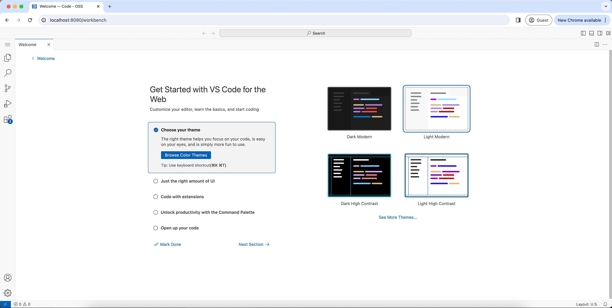

## Installation

1. Download the latest release from the [releases page](https://github.com/jlewi/foyle/releases)

1. On Mac you may need to remove the quarantine attribute from the binary

   ```bash
   xattr -d com.apple.quarantine /path/to/foyle
   ```

## Setup

1. Download the static assets for foyle

   ```bash
   foyle assets download
   ```

   * This downloads the static assets for foyle. 
   * The assets are stored in `${HOME}/.foyle/assets`.

1. Configure your OpenAPI key

   ```
   foyle config set openai.apiKeyFile=/path/to/openai/apikey
   ```
 
   * If you don't have a key, go to [OpenAI](https://openai.com/) to
   obtain one

1. Start the server

    ```bash
    foyle serve
    ```
    
    * By default foyle uses port 8080 for the http server and port 9080 for gRPC
    * If you need to use different ports you can configure this as follows

      ```
      foyle config set server.httpPort=<YOUR HTTP PORT>
      foyle config set server.grpcPort=<YOUR GRPC PORT> 
      ```
## Try it out!

Now that foyle is running you can open up VSCode in your web browser and start interacting with foyle.

1. Open up your browser and go to [http://localhost:8080/workbench](http://localhost:8080/workbench)
1. The first time you open the workbench you will be prompted to choose a theme as shown below.

   * Choose your theme and then click `mark done` 
   
1. Open the explorer tab by clicking the icon in the left hand side navigation bar
1. Inside the explorer tab click the link to `add a folder`

   * Unfortunately **Open Folder** doesn't work reliably. [jlewi/foyle#21](https://github.com/jlewi/foyle/issues/21)
     is tracking this.
1. This should open a file explorer and you should select the folder where you want your foyle notebooks to be
   saved
   * Your browser will likely prompt you to allow the site to access the file system; you need to allow this
1. You should now see the folder you selected in the explorer tab
1. Start a new notebook by clicking the `+` icon in the explorer tab
1. Give your notebook the ".foyle" extension
   * Your notebook must have the ".foyle" extension so that vscode knows to open it using foyle
1. Click on your new notebook to open it inside VSCode's notebook editor
1. You can now add code and notebook cells like you normally would in vscode
1. To ask Foyle for help do one of the following

   * Open the command pallet and search for `Foyle generate a completion`
   * Use the shortcut key:
     * "win;" - on windows
     * "cmd;" - on mac

## Customizing Foyle VSCode Extension Settings

### Customizing the server endpoints

If you are running the Foyle server on a different port or address then you will need to change Foyle's VSCode settings.

1. Open the settings panel; you can click the gear icon in the lower left window and then select settings
1. Search for `Foyle`
1. Set `Foyle-notebook: Agent-address` to the address of the Foyle server to use as the Agent
   * The Agent handles requests to generate completions
1. Set `Foyle-notebook: Executor-address` to the address of the Foyle server to use as the Executor
   * The Executor handles requests to execute commands

### Customizing the keybindings

If you are unhappy with the default key binding to generate a completion you can change it as follows

1. Click the gear icon in the lower left window and then select "Keyboard shortcuts"
1. Search for "Foyle"
1. Change the keybinding for `Foyle: generate a completion` to the keybinding you want to use