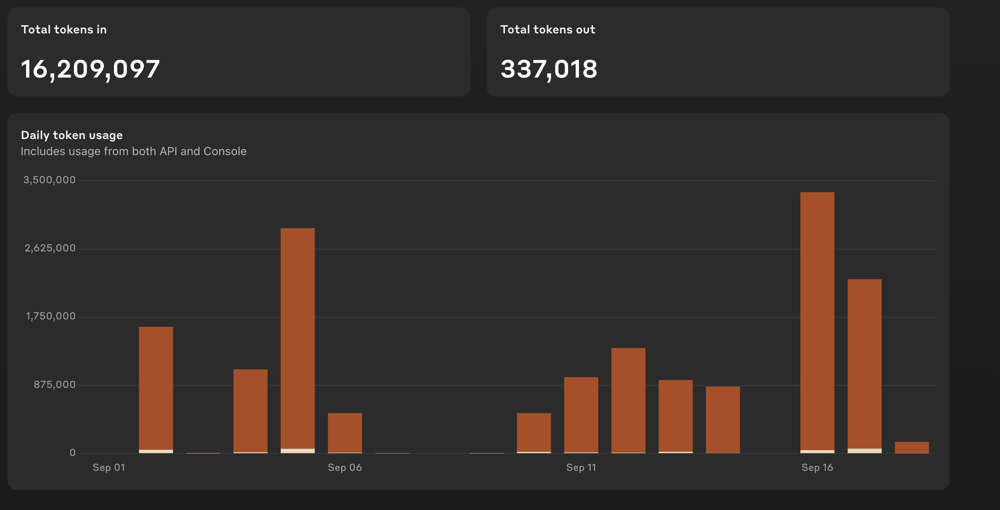

## Objective

* Understand Why Foyle Costs So Much
* Figure out how to reduce the costs

## TL;DR

Since enabling Ghost and upgrading to Sonnet 3.5 and GPT40 Cells, Foyle has been using a lot of tokens.

We need to understand why and see if we can reduce the cost without significantly impacting quality. In particular,
there are two different drivers of our input tokens

* How many completions we generate for a particular context (e.g. as a user types)
* How much context we include in each completion

Analysis indicates that we are including way too much context in our LLM requests and can reduce it by 10x to make the costs more manageable. An initial target is to spend ~\$.01 per session. Right now sessions are costing beteen \$0.10 and \$0.30.

## Background

### What is a session

The basic interaction in Foyle is as follows:

1. User selects a cell to begin editing

   * In VSCode each cell is a text editor so this corresponds to changing the active text editor

2. A user starts editing the cell
3. As the user edits the cell (e.g. types text), Foyle generates suggested cells to insert based on the current context of the cell.

   * The suggested cells are inserted as ghost cells

4. User switches to a different cell

We refer to the sequence of events above as a session. Each session is associated with a cell that the user is editing.
The session starts when the user activates that cell and the session ends when the user switches to a different cell.

## How Much Does Claude Cost

The graph below shows my usage of Claude over the past month.


Figure 1. My Claude usage over the past month. The usage is predominantly from Foyle although there are some other minor usages (e.g. with Continue.dev). This is for Sonnet 3.5 which is \$3 per 1M input tokens and \$15 per 1M output tokens.

Figure 1. Shows my Claude usage. The cost breakdown is as follows.

| Type | # Tokens | Cost |
|------|----------|------|
| Input | 16,209,097 | $48.6 |
| Output | 337,018| $4.5 |

So cost is dominated by input tokens.

### Cost Per Session

We can use the query below to show the token usage and cost per session.

```bash
sqlite3 -header /Users/jlewi/.foyle/logs/sessions.sqllite3 "
SELECT 
    contextid,
    total_input_tokens,
    total_output_tokens,
    num_generate_traces,
    total_input_tokens/1E6 * 3 as input_tokens_cost,
    total_output_tokens/1E6 * 15 as output_tokens_cost
FROM sessions 
WHERE total_input_tokens > 0 OR total_output_tokens > 0 OR num_generate_traces > 0
ORDER BY contextId DESC;
" 
```

|contextID|total_input_tokens|total_output_tokens|num_generate_traces|input_tokens_cost|output_tokens_cost |
|---------|-------------------|-------------------|-------------------|-------------------|--------------------|
|01J83RZGPCJ7FJKNQ2G2CV7JZV|121105|1967|24|0.363315|0.029505 |
| 01J83RYPHBK7BG51YRY3XC2BDC|31224|967|6|0.093672|0.014505|
01J83RXH1R6QD37CQ20ZJ61637|92035|1832|20|0.276105|0.02748
01J83RWTGYAPTM04BVJF3KCSX5|45386|993|11|0.136158|0.014895
01J83R690R3JXEA1HXTZ9DBFBX|104564|1230|12|0.313692|0.01845
01J83QG8R39RXWNH02KP24P38N|115492|1502|17|0.346476|0.02253
01J83QEQZCCVWSSJ9NV57VEMEH|45586|432|6|0.136758|0.00648
01J83ACF7ARHVMQP9RG2DTT49F|43078|361|6|0.129234|0.005415
01J83AAPT28VM05C90GXS8ZRBT|19151|132|5|0.057453|0.00198
01J83AA5P4XT6Z0XB40DQW572A|38036|615|6|0.114108|0.009225
01J838F559V97NYAFS6FZ2SBNA|29733|542|6|0.089199|0.00813

Table 1. Results of measuring token usage and cost per session on some of my recent queries.

The results in Table 1. indicate that the bigger win is likely to come from reducing the amount of context and thus
token usage rather than reducing the number of completions generated. Based on table 1 it looks like we could at best
reduce the number of LLM calls by 2x-4x. For comparison, it looks like input token is typically 100x our output tokens.
Since we ask the model to generate a single code block (although it may generate more), we can use the output tokens as a rough estimate of the number of tokens in a typical cell. This suggests we are using ~10-100 cells of context for each completion. This is
likely way more than we need.

## Discussion

### Long Documents

I think the outliers in the results in Table 1, e.g. `01J83RZGPCJ7FJKNQ2G2CV7JZV` which cost \$.36,
can be explained by long documents. I use a given markdown document to take running notes on a topic.
So the length of the document can grow quite long leading to a lot of context being sent to Claude.

In some cases, earlier portions of the document are highly relevant. Consider the following sequence of actions:

* I come up with a logging query to observe some part of the system
* The result shows something surprising
* I run a bunch of commands to investigate whats happening
* I want to rerun the logging query

In this case, the cell containing the earlier query can provide useful context for the current query. 

Including large portions of the document may not be the most token efficient way to make that context available to the model. In Foyle since learning happens online, relying on learning to index the earlier cell(s) and retrieve the relevant ones might
be a more cost effective mechanism than relying on a huge context window.

### How much context should we use?

If we set a budget for sessions than we can use that to put a cap on the number of input tokens.

Lets assume we want to spend ~ \$.01 on input tokens per session. This suggests we should use ~3333 input tokens per session.

If we assume ~6 completions per session then we should use a max of ~555 input tokens per completion.

We currently limit the context based on characters to [16000](https://github.com/jlewi/foyle/blob/5f30c461b1f178474d23e08a5bca073ca93724f8/app/pkg/agent/agent.go#L48) which should be ~8000 tokens (assuming 1 token = 2 characters)

### num_generate_traces with outliers

A cell with a really high number of completions (e.g. 24) is likely to be a cell that a user spends a long time writing.
For me at least, these cells tend to correspond to cells where I'm writing exposition and not necessarily expressing intents
that should be turned into commands. So in the future we might want to consider how to detect this and limit completion generation in those
calls.

### Less Tokens -> More completions

Right now our algorithm for deciding when to initiate a new completion in a session is pretty simple. If the cell contents
have changed then we generate a new completion as soon as the current running completion finishes. Reducing input tokens will likely
make generations faster. So by reducing input tokens we might increase the average number of completions per session which might
offset some of the cost reductions due to fewer input tokens.

## Appendix: Curious Result - Number Of Session Starts

In the course of this analysis I observed the surprising result that the number of session starts is higher than the
number StreamGenerate events.

We can use logs to count the number of events in a [14 day window](https://cloudlogging.app.goo.gl/WtF3TXKtEuRkjJji9).

| Event Type | Count |
|------------|-------|
|Session Start| 792 |
|Agent.StreamGenerate| 332 |
|Agent.Generate | 1487 |

I'm surprised that the number of Session Start events is higher than the number of Agent.StreamEvents. I would have expected `Agent.StreamGenerate` to be higher than `Session Start` since for a given session the stream might be recreated multiple times (e.g. due to timeouts). A SessionStart is reported when the [active text editor changes](https://github.com/stateful/vscode-runme/blob/1a48894c9fcada0234a5695b7ec3ed7b7fb803c6/src/extension/ai/ghost.ts#L220). A stream should be created when the [cell contents change](https://github.com/stateful/vscode-runme/blob/1a48894c9fcada0234a5695b7ec3ed7b7fb803c6/src/extension/ai/ghost.ts#L315). So the data implies that we switch the active text editor without changing the cell contents.

The number of `Agent.Generate` events is ~4.5x higher than `Agent.StreamGenerate`. This means on average we do at least 4.5 completions per session. However, a session could consist of multiple `StreamGenerate` requests because the stream can be interrupted and restarted; e.g. because of timeouts.

