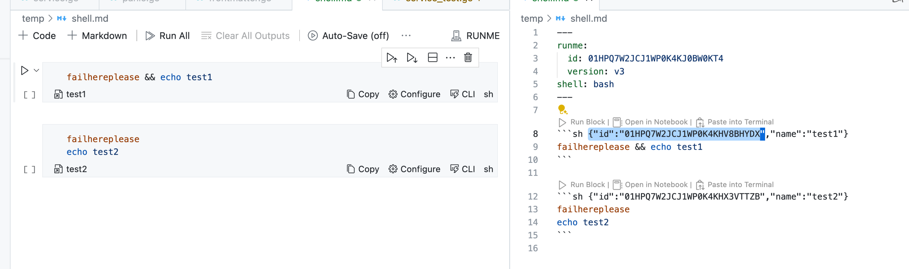

# Integration With Runme.Dev

* **Author**: Jeremy Lewi
* **Last Updated**: 2024-05-07
* **Status**: Published

## Objective

Understand what it would take to integrate Foyle's AI capabilities with [runme.dev](https://runme.dev/).

## TL;DR

[runme.dev](https://docs.runme.dev/) is an OSS tool for running markdown workflows. At a high level its architecture
is very similar to Foyle's. It has a frontend based on vscode notebooks which talks to a GoLang server. It has
several critical features that Foyle lacks:
 * it supports native renderers which allow for output
to be rendered as rich, interactive widgets in the notebook 
([examples](https://github.com/stateful/vscode-runme/blob/main/examples/gcp/gke.md))
 * it supports streaming the output of commands
 * it supports setting [environment variables](https://docs.runme.dev/guide/docker)
 * it supports redirecting stdout and stderr to files
 * markdown is Runme's native file format
 * cell ids are persisted to markdown enabling lineage tracking when serializing to markdown

In short it is a mature and feature complete tool for running Notebooks. Foyle, in contrast, is a bare bones 
prototype that has frustrating bugs (e.g. [output isn't scrollable](https://github.com/jlewi/foyle/issues/86)). The
intent of Foyle was always to focus on the AI capabilities. The whole point of using VSCode Notebooks was to leverage
an existing OSS stack rather than building a new one. There's no reason to build a separate stack if there's is an
OSS stack that meets our needs. 

Furthermore, it looks like the RunMe community has significantly more expertise in building VSCode Extensions
([vscode-awesome-ux](https://github.com/stateful/vscode-awesome-ux]) and [tangle](https://github.com/stateful/tangle)).
This could be a huge boon because it could open the door to exploring better affordances for interacting with the AI.
The current UX in Foyle was designed entirely on minimizing the amount of frontend code.

Runme already has an existing community and users; its always easier to ship features to users than users to features.

For these reasons, integrating Foyle's AI capabilities with Runme.dev is worth pursuing. Towards that end,
this document tries to identify the work needed for a POC of integrating Foyle's AI capabilities with Runme.dev.
Building a POC seems like it would be relatively straightforward

* Foyle needs to add a new RPC to generate cells using Runme's protos
* Runme's vscode extension needs to support calling Foyle's GenerateService and inserting the cells

Fortunately, since Runme is already assigning and tracking cell ids, very little needs to change to support
collecting the implicit feedback that Foyle relies on.

The current proposal is designed to minimize the number of changes to either code base. In particular, the current
proposal assumes Foyle would be started as a separate service and Runme would be configurable to call Foyle's 
GenerateService. This should be good enough for experimentation. Since Foyle and Runme are both GoLang gRPC services, building a
single binary is highly feasible but might require come refactoring. 

## Background

### Execution in Runme.Dev

[runme.dev](https://docs.runme.dev/) uses the 
[RunnerService](https://github.com/stateful/runme/blob/90d89e57a9996bdcceb0ad7983fab30b02707d1f/internal/api/runme/runner/v2alpha1/runner.proto#L259)
to execute programs in a [kernel](https://docs.runme.dev/architecture). Kernels are stateful. Using the RunnerService
the client can create sessions which persist state across program executions. 
The [Execute method](https://github.com/stateful/runme/blob/90d89e57a9996bdcceb0ad7983fab30b02707d1f/internal/api/runme/runner/v2alpha1/runner.proto#L133)
can then be used to execute a program inside a session or create a new session if none is specified.

### IDs in Runme.Dev

Runme assigns [ULIDs](https://github.com/ulid/spec) to cells. These get encoded in the language annotation of the fenced
block when serializing to markdown.



These ids are automatically passed along in the 
[known_id](https://github.com/stateful/runme/blob/f522c3a6122381b8de0e0c8b25b2c963423d310c/internal/api/runme/runner/v1/runner.proto#L186)
field of the ExecuteRequest.

In the Cell Proto. The id is stored in the metadata field id. When cells are persisted any information in the metadata
will be stored in the language annotation of the fenced code block as illustrated above.

### Logging in Runme.Dev

Runme uses [Zap](https://github.com/stateful/runme/blob/90d89e57a9996bdcceb0ad7983fab30b02707d1f/internal/cmd/common.go#L153) 
for logging. This is the same logger that Foyle uses.

### Foyle Architecture

Foyle can be broken down into two main components

* GRPC Services that are a backend for the VSCode extension - these services are directly in the user request path
* Asynchronous learning - This is a set of asynchronous batch jobs that can be run to improve the AI. At a high level
  these jobs are responsible for extracting examples from the logs and then training the AI on those examples.
  
Foyle has two GRPC services called by the VSCode extension

* [GenerateService](https://github.com/jlewi/foyle/blob/main/protos/foyle/v1alpha1/agent.proto) - Uses AI to
  author cells to be inserted into the doc
* [ExecuteService](https://github.com/jlewi/foyle/blob/main/protos/foyle/v1alpha1/agent.proto) - Executes cells

For the purpose of integrating with Runme.dev only GenerateService matters because we'd be relying on Runme.dev to 
execute cells.

## Integrating Foyle with Runme.Dev

### Foyle Generate Service Changes

Foyle would need to expose a new RPC to generate cells using Runme's protos.

```proto

message RunmeGenerateRequest {
  runme.parser.v1.Notebook notebook;
}

message RunmeGenerateResponse {
  repeated runme.parser.v1.Cell cells = 1;
}

service RunmeGenerateService {  
  rpc Generate (RunmeGenerateRequest) returns (RunmeGenerateResponse) {}
}
```

To implement this RPC we can just convert Runme's protos to Foyle's protos and then reuse the existing
implementation.

Since Runme is using ULIDs Foyle could generate a ULID for each cell. It could then log the ULID along with the
block id so we can link ULIDs to cell ids. In principle, we could refactor Foyle to use ULIDs instead of UUIDs.

Ideally, we'd reuse Runme's [ULID Generator](https://github.com/stateful/runme/blob/90d89e57a9996bdcceb0ad7983fab30b02707d1f/internal/ulid/generator.go#L58)
to ensure consistency. That would require a bit of refactoring in Runme to make it accessible because it is currently
private.
 
### Runme Frontend Changes

Runme.dev would need to update its VSCode extension to call the new `RunmeGenerateService` and insert the cells.
This mostly likely entails adding a VSCode Command and hot key that the user can use to trigger the generation of cells.

Runme would presumably also want to add some configuration options to enable the Foyle plugin and configure the
endpoint.

### Runme Logging Changes

Foyle relies on structured logging to track cell execution. Runme uses Zap for logging and uses structured logging
by default ([code](https://github.com/stateful/runme/blob/90d89e57a9996bdcceb0ad7983fab30b02707d1f/internal/cmd/common.go#L153)).
This is probably good enough for a V0 but there might be some changes we want to make in the future. Since the AI's
ability to improve depends on structured logging to a file; we might want to configure two separate loggers so
a user's configuration doesn't interfere with the AI's ability to learn. Foyle uses a 
[Zap Tee Core](https://github.com/jlewi/foyle/blob/dca28ab8423d48c50ca62be3dedd451fa1c15c45/app/pkg/application/app.go#L173)
to route logs to multiple sinks. Runme could potentially adopt the same approach if its needed.

I suspect Runme's execution code is already instrumented to log the information we need but if not we may need to
add some logging statements. 

### Changes to Foyle Learning

We'd need to update Foyle's learning logic to properly extract execution information from Runme's logs.

### Security & CORS

Foyle already supports CORs. So users can already configure CORS in Foyle to accept requests from Runme.dev if its
running in the browser.

## Discussion

There are two big differences between how Foyle and Runme work today

1. Runme's Kernel is stateful where as Foyle's Kernel is stateless
   * There is currently no concept of a session in Foyle
1. Foyle currently runs vscode entirely in the web; Runme can run vscode in the web but depends on [code-server](https://docs.runme.dev/how-runme-works/web)

One potential use case where this comes up is if you want to centrally manage Foyle for an organization. I heard
from one customer that they wanted a centrally deployed webapp so that users didn't have to install anything
locally. If the frontend is a progressive web app and the kernel is stateless then its easy, cheap, and highly
scalable to deploy this centrally. I'd be curious if this is a deployment configuration that Runme has heard customers
asking for?

## References

### Runme.dev source links

[GRPC Server](https://github.com/stateful/runme/blob/main/internal/server/server.go)
[Proto definitions](https://github.com/stateful/runme/tree/main/internal/api/runme)
* [Parser Service](https://github.com/stateful/runme/blob/main/internal/api/runme/parser/v1/parser.proto)   
  * Handles serialization to/from markdown to a notebook
* [Runner Service](https://github.com/stateful/runme/blob/main/internal/api/runme/runner/v2alpha1/runner.proto)
  * Responsible for actually executing commands

[runner/service.go](https://github.com/stateful/runme/blob/main/internal/runner/service.go#L203)
   * Implementation of the runner service

[vscode-runme](https://github.com/stateful/vscode-runme)
* The repository containing the vscode extension for runme.dev
[kernel.ts](https://github.com/stateful/vscode-runme/blob/397c55e1fa67e21c9da6e7f638e1c8915bb2ab26/src/extension/kernel.ts#L484) VSCodeNotebook Controller
* [_doExecuteCell](https://github.com/stateful/vscode-runme/blob/397c55e1fa67e21c9da6e7f638e1c8915bb2ab26/src/extension/kernel.ts#L583)
  execute an individual cell
* [_executeAll](https://github.com/stateful/vscode-runme/blob/397c55e1fa67e21c9da6e7f638e1c8915bb2ab26/src/extension/kernel.ts#L484)

## Appendix: Miscellaneous notes about how runme.dev works

* If an execute request doesn't have a session id, a new session is created [code](https://github.com/stateful/runme/blob/90d89e57a9996bdcceb0ad7983fab30b02707d1f/internal/runner/service.go#L238)
* It uses a pseudo terminal to execute commands [code](https://github.com/stateful/runme/blob/main/internal/runner/command.go#L33)
* It looks like the VSCode extension relies on the backend doing serialization via RPC [code](https://github.com/stateful/vscode-runme/blob/397c55e1fa67e21c9da6e7f638e1c8915bb2ab26/src/extension/extension.ts#L99)
  however it looks like they are experimenting with possibly using WASM to make it run in the client

* [NotebookCellManager](https://github.com/stateful/vscode-runme/blob/397c55e1fa67e21c9da6e7f638e1c8915bb2ab26/src/extension/cell.ts#L54)  
  * It manages a map from cells to a [NotebookCellOutputManager](https://github.com/stateful/vscode-runme/blob/397c55e1fa67e21c9da6e7f638e1c8915bb2ab26/src/extension/cell.ts#L118)
  * It contains a VSCodeNotebookController
  * I think [NotebookCellOutputManager](https://github.com/stateful/vscode-runme/blob/397c55e1fa67e21c9da6e7f638e1c8915bb2ab26/src/extension/cell.ts#L118)
    orchestrates executing a cell and rendering the outputs
   * [createNotebookCellExecution](https://github.com/stateful/vscode-runme/blob/397c55e1fa67e21c9da6e7f638e1c8915bb2ab26/src/extension/cell.ts#L375)
     * Launches a cell execution