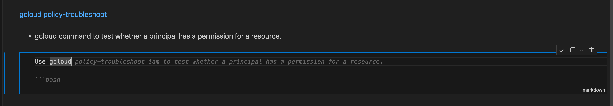

# Multi-Step Workflows

* **Author**: Jeremy Lewi
* **Last Updated**: 2024-06-30
* **Status**: Published

## Objective

* Brainstorm some initial ideas for how we can support multi-step workflows

## TL;DR

Foyle does a good job of achieving intents which require a single action to achieve; 
e.g. [generating a Honeycomb query](https://foyle.io/docs/integrations/honeycomb/) or 
[a BigQuery query](https://foyle.io/docs/integrations/bigquery/). We'd like to extend Foyle to support
multi-step workflows. This is an initial document to brainstorm some ideas. At a high level there are two approaches
we could take

1. Recursively generate next action prediction to achieve multi-step workflows
2. Directly learn and predict multi-step workflows

## Motivation: Examples of Multi-Step Workflows

Here are some examples of multi-step workflows.

### GitOps Workflows

Suppose we are using GitOps and [Flux](https://fluxcd.io/) and want to determine whether the Foo service is up to
date. We can this as follows. First we can use `git` to get latest commit of the repository

```bash
git ls-remote https://github.com/acme/foo.git   
```

Next we can get the [flux kustomization](https://fluxcd.io/flux/components/kustomize/kustomizations/) for the Foo service
to see what git commit has been applied

```bash
kubectl get kustomization foo -o jsonpath='{.status.lastAppliedRevision}'
```

Finally we can compare the two commits to see if the service is up to date.

Notably, in this example neither of the commands directly depends on the output of another command. However, this 
won't always be the case. For example, if we wanted to check whether a particular K8s deployment was up to date we
might do the following

1. Use `kubectl get deploy` to get the flux annotation  `kustomize.toolkit.fluxcd.io/name` to identify the kustomization
2. Use `kubectl get kustomization` to get the last applied revision of the customization and to identify the source
   controller
3. Use `kubectl get gitrepository` to get the source repository and its latest commit

In this case the command at each step depends on the output of the previous step.


### Troubleshooting Workload Identity and GCP Permissions

Troubleshooting workflows are often multi-step workflows. For example, suppose we are trying to troubleshoot why a
pod on a GKE cluster can't access a GCS bucket. We might do the following

1. Use kubectl to get the deployment to identify the Kubernetes service account (KSA)
2. Use kubectl to get the KSA to identify and get the annotation specifying the GCP service account (GSA)
3. Use `gcloud policy-troubleshoot iam` to check whether the GSA has the necessary permissions to access the GCS bucket

### Design

Two approaches

1. Recursively generate next action prediction to achieve multi-step workflows
2. Multi step prediction

TODO: With multi-step prediction how do we update a predicted step if it depends on the output of a previous step?
One way to do this is with variables. e.g.

```
REVISION=$(kubectl get kustomization foo -o jsonpath='{.status.lastAppliedRevision}')
```

Down side of this approach is
1. As humans we don't benefit from the full output
2. We can't rely on the AI to parse out the relevant information and insert it into the next command. 

For approach 1 - how do we continuously generate predictions in the background? 

We could create a streaming connection to continually push user input changes and get back the predictions.


Ghost Cells I'm not sure we can actually render Ghost cells in vcode notebook UI. But maybe we could just render
normal cells as a starting point and see how that goes. 


## UX For Continuous Suggestion

As the user edits one cell (either markdown or code), we'd like Foyle to be continuously running in the background to 
generate one or more cells to be inserted after the current cell. This is similar to GitHub Copilot and 
[Continue.Dev Autocomplete](https://docs.continue.dev/walkthroughs/tab-autocomplete. An important difference
is that we don't need Foyle to autocomplete the current cell. This should simplify the problem because we don't need
to check that the completion is still valid after each character is typed into the current cell because we aren't
trying to auto complete the word(s) and current cell.

If we mimicked ghost text. The experience might look as follows

* User is editing cell N in the notebook
* Foyle is continuously running in the background to generate suggested cells N+1,..., N+K
* The suggested cells are N+1,...,N+k are rendered in the notebook in a manner that makes it clear that they are suggestions
  that haven't been accepted or rejected yet
  * Following Ghost Text we could use a grayed out font and different border for the cells 
* As the user edits cell N, Foyle updates and edits N+1,...,N+K to reflect changes to its suggestions
* The decision to accept or reject the situation is triggered when the user decides to move onto cell N+1 
  * At this point the user decides to either accept Foyle's suggested cell N+1 or create a new one.
  * If the user goes back to a previous cell that should be considered rejecting the suggestion for the cell 

I don't know if vscode's APIs make it easy to change the rendering of the suggested cells. For a V0 we can ignore that
and just use [notebook.Edit](https://github.com/stateful/vscode-runme/blob/686f9f0904d65f061d2a270b8de3ea8a4ede9b0f/src/extension/ai/generate.ts#L110)
to insert the suggested cells.

We can use [Notebook Cell Metadata](https://github.com/stateful/vscode-runme/blob/686f9f0904d65f061d2a270b8de3ea8a4ede9b0f/src/extension/ai/generate.ts#L95)
to keep track of cells that are associated with a particular suggestion and need to be accepted or rejected.

I think the [INotebookEditor interface](https://github.com/microsoft/vscode/blob/3581a121d1c05455c5bed4e79973c75ef8b9c6de/src/vs/workbench/contrib/notebook/browser/notebookBrowser.ts#L486)
defines two events that could be used to trigger code that runs when the user switches the focus away from the current
cell.

```
export interface INotebookEditor {
	...
	readonly onDidChangeActiveCell: Event<void>;
	readonly onDidChangeActiveKernel: Event<void>;
}
```

<TODO update this based on this thread https://discord.com/channels/1102639988832735374/1258178478910603365/1258195073452216392
it looks like INotebookEditor is an internal only API but there's an API in there we can hopefully use.>

When this happens we can check if there are any unaccepted suggestions
and if so delete them. See [Appendix](#vscodeevents) for a snippet generated by Claude for registering event handlers.

To accept the suggestion we could add a hotkey that means `accept suggested cells and switch focus to first code cell in the suggestion`

## Completion Protocol

Our existing[GenerateService](https://github.com/jlewi/foyle/blob/4e2db25378712e9b33d8257aae4f4a62d0edfa49/protos/foyle/v1alpha1/agent.proto#L27)
is a unary RPC call. This isn't ideal for continually generating suggestions as a user updates a block.
We can use the [connect protocol](https://connectrpc.com/docs/protocol/#streaming-rpcs) to define a full streaming RPC 
call for generating suggestions. This will allow the client to stream updates to the doc to the generate
service and the generate service to respond with a stream of completions.

```proto
// Generate completions using AI
service GenerateService {
  // StreamGenerate is a bidirectional streaming RPC for generating completions
  rpc StreamGenerate (stream StreamGenerateRequest) returns (stream StreamGenerateResponse) {}
}

message StreamGenerateRequest {
  oneof request {
    FullContext full_context = 1;
    BlockUpdate update = 2;
    Finish finish = 3;
  }
}

message FullContext {
  Doc doc = 1;
  int selected = 2;
}

message BlockUpdate {
  string block_id = 1;
  string block_content = 2;
}

message Finish {
    // Indicates whether the completion was accepted or rejected.
    bool accepted = 1;
}

message StreamGenerateResponse {
  repeated Block blocks = 1;
}
```

The stream will be initiated by the client sending a `FullContext` message with the full document and the index
of the current cell that is being edited. Subsequent messages will be `BlockUpdate` containing the full content
of the current cell.

Each `StreamGenerateResponse` will contain a complete copy of the latest suggestion. This is simpler than 
only sending and applying deltas relative to the previous response. 

## Client Changes

In vscode we can use the 
[onDidChangeTextDocument](https://github.com/microsoft/vscode/blob/ea1445cc7016315d0f5728f8e8b12a45dc0a7286/src/vscode-dts/vscode.d.ts#L13448)
to listen for changes to the a notebook cell (for more detail see [appendix](#vscodebackground)). We can handle
this event by initializing a streaming connection to the backend to generate suggestions. On subsequent changes
to the cell we can stream the updated cell contents to the backend to get updated suggestions.

We could use a rate limiting queue (
i.e. similar to [workqueue](https://github.com/kubernetes/client-go/blob/master/util/workqueue/rate_limiting_queue.go)
but implemented in TypeScript) to ensure we don't send too many requests to the backend. Each time the cell changes
we can enqueue an event and update the current contents of the cell. We can then process the events with rate limiting
enforced. Each time we process an event we'd send the most recent version of the cell contents. 

## LLM Completions

The backend will generate an LLM completion in response to each `StreamGenerateRequest` and then return the response
in a `StreamGenerateResponse`. This is the simplest thing we can do but could be wasteful as we could end up
recomputing the completion even if the cell hasn't changed sufficiently to alter the completion. In the future, 
we could explore more sophisticated strategies for deciding when to compute a new completion. One simple thing
we could do is

* Tokenize the cell contents into words
* Assign each word a score measuring its information content `-log(p(w))` where `p(w)` is the probability of the word
  in the training data.
* Generate a new completion each time a word with a score above a threshold is added or removed from the cell.

### Multiple completions

Another future direction we could explore is generating multiple completions and then trying to rank them and select
the best one. Alternatively, we could explore a UX that would make it easy to show multiple completions and let the
user select the best one.

## Collecting Feedback And Learning
 
As described in [TN002 Learning](tn002_learning.md) and in the blog post 
[Learning](https://foyle.io/docs/blog/learning/), Foyle relies on implicit human feedback to learn from its mistakes.
Currently, Foyle only collects feedback when a user asks for a suggestion. By automatically generating suggestions
we create more opportunities for learning and should hopefully increase Foyle's learning rate.

The protocol defined in the previous section lets us log the final completion and whether it was accepted or rejected.
When the user changes the selected cell they must either accept or reject the completion. Using the protocol
we can send a final `StreamGenerateRequest` which contains

* The final input cell 
* A `Finish` message indicating whether the completion was accepted or rejected.

Using our existing learning protocol we can then log any executed cells and see if the user modified the completion
cell.

One of the strongest signals we can collect is when the user rejects the completion. In this case, we'd like to log
and learn from whatever code cell the user ends up manually entering and executing. Right now Foyle relies on
[RunMe's Runner Service](https://github.com/stateful/runme/blob/main/pkg/api/proto/runme/runner/v2alpha1/runner.proto#L125)
to log cell executions. This method only contains the executed cell and not any preceeding cells. We need those
preceeding cells in order to learn.

The easiest thing to do would be to add to Foyle a logging service such as

```
service LogService {/
  rpc LogSnippet (request LogSnippet) returns (response LogResponse) {}
}

message LogSnippet {
  repeated Cell cells = 1;
}

message LogResponse {}
```

The frontend could then be instrumented to send a log request anytime a block is executed so we can capture the cells
preceding the cell that is being executed. Since RunMe assigns a unique ID to each cell we can use that ID to link
the LogSnippet in Foyle's logs with RunMe's logs which contain information about the cell execution.

## Alternative Designs

### Complete the current cell

The current proposal calls for "Auto-Inserting" one or more cells but not autocompleting the current cell. An
alternative would be to do both simultaneously

* Autocomplete the current cell
* Auto-Insert one or more cells after the current cell

One of the reasons for not autocompleting the current cell is because GitHub copilot already does that. Below
is a screen shot illustrating GitHub populating the current cell with Ghost Text containing a possible completion.



More importantly, the problem we want to use Foyle to solve is turning a higher level expression of intent into
level actions. In this context a user edits a markdown cell to express their intent. The actions are rendered
as code cells that would come next. So by focusing on generating the next code cells we are scoping the problem
to focus on generating the actions to accomplish the intent rather than helping users express their intent.

By focusing on generating the next cell rather than completing the current cell we can tolerate higher latencies
for completion generation than in a traditional autocomplete system. In a traditional autocomplete system you
potentially want to update the completion after each character is typed leading to very tight latency requirements. 
In the proposal our latency bounds are determined by how long it takes the user to complete the current cell and
move onto the next cell. We can take advantage of this to use larger models and longer context windows which should
lead to better suggestions.

## References

* [Continue.Dev](https://www.continue.dev/)
   * [Prompt for Autocomplete](https://github.com/continuedev/continue/blob/d2bc6359e8ebf647892ec953e418042dc7f8a685/core/autocomplete/templates.ts)
   * [Completion Provider](https://github.com/continuedev/continue/blob/22794894bf578a705f75faf6ed50bb5d8b676cf0/core/autocomplete/completionProvider.ts#L231)
     * It looks like completion is a unary call and not a streaming call.
     * I don't think continue.dev has a notion of a vscode client and backend where the backend is talking to
       the LLM. So I don't think it would have a streaming protocol for updating the backend as additional keys
       are typed.

* [Jupyter Shortcut Keys](https://bbyond.medium.com/vscode-jupyter-notebook-keyboard-shortcuts-31fab95fa301)

* [Connect Protocol For Streaming RPCs](https://connectrpc.com/docs/protocol/#streaming-rpcs)

* [foyle#111](https://github.com/jlewi/foyle/issues/111) Open issue about changing the prompt for fill in the midel.

* Docs about implementing autocomplete 
  * [Designing Typeahead System](https://systemdesignschool.io/problems/typeahead/solution)
  * [Typeahead at PInterest](https://medium.com/pinterest-engineering/rebuilding-the-user-typeahead-9c5bf9723173)

### VSCode

* [VSCode GitHub Chat API](https://code.visualstudio.com/api/extension-guides/chat)
    * I think using the VSCode Chat API to contribute a participant still requires GitHub Copilot
* [VSCode Extension API](https://github.com/microsoft/vscode/blob/1.91.0/src/vscode-dts/vscode.d.ts#L836)
* [VSCode Extension Comment Controller Sample](https://github.com/microsoft/vscode-extension-samples/tree/main/comment-sample)
    * VSCode has a comment controller API which could potentially be used to allow commenting on cells as a way of
      interacting with the AI
    * [Discord Thread](https://discord.com/channels/1102639988832735374/1258178478910603365/1258201202928259102)
## How does LLM triggering work in Autocomplete

Typically in autocomplete you are completing the stream of characters a user is typing. So as each character
is added it could invalidate one or more completions. For example if the user enters the character "n" possible
completions are "news...", "normal...", etc... When the user enters the next character "ne" we'd like to immediately
update the ranking of completions and reject any that are no longer valid.

One way to handle this is each time you generate a completion you could ask the LLM to generate multiple completions 
(e.g. [OpenAI]'s n parameter)(https://platform.openai.com/docs/api-reference/chat/create). These completions
should represent the most likely completions given the current input. Each additional character can then be used
to invalidate any suggestions that don't match.


### <a id="vscodebackground"> Appendix: VSCode Background

This section provides information about how VSCode extensions and notebooks work. It is relevant for figuring
out how to implement the extension changes.

In VSCode notebooks each cell is just a discrete text editor 
([discord thread](https://discord.com/channels/1102639988832735374/1258178478910603365/1258195279677624361).
VScode's extension API is defined [here](https://github.com/microsoft/vscode/blob/1.91.0/src/vscode-dts/vscode.d.ts#L836).


The [onDidChangeTextDocument](https://github.com/microsoft/vscode/blob/ea1445cc7016315d0f5728f8e8b12a45dc0a7286/src/vscode-dts/vscode.d.ts#L13448)
fires when the text in a document changes. This could be used to trigger the AI to generate suggestions.

As described in [vscode_apis](https://github.com/jlewi/foyle/blob/main/frontend/foyle/vscode_apis.md) Notebooks have
a data API ((NotebookData, NotebookCellData) and and editor API(NotebookDocument, NotebookCell). NotebookCell contains
a TextDocument which we should be able to use to listen for onDidChangeTextDocument events.

I think you can register a handler that will fire for changes to any TextDocument change and not just for a particular
cell. The document URI should use the `vscode-notebook-cell` scheme and allow us to identify the notebook document
and cell that changed ([code example](https://github.com/microsoft/vscode/blob/6eaf6487a4d8301b981036bfa53976546eb6694f/extensions/vscode-api-tests/src/singlefolder-tests/notebook.document.test.ts#L70)).

## <a id="vscodeevents"> Appendix: Registering vscode event handlers </a>

Here's a snippet generated by Claude for registering a handler for VSCode events about changing the cell focus.

```ts
import * as vscode from 'vscode';

export function activate(context: vscode.ExtensionContext) {
    // Get the active notebook editor
    let activeNotebookEditor = vscode.window.activeNotebookEditor;

    // Function to update the active notebook editor
    function updateActiveEditor() {
        activeNotebookEditor = vscode.window.activeNotebookEditor;
        if (activeNotebookEditor) {
            // Subscribe to events for the new active editor
            subscribeToEditorEvents(activeNotebookEditor);
        }
    }

    // Subscribe to the change of the active notebook editor
    context.subscriptions.push(
        vscode.window.onDidChangeActiveNotebookEditor(() => {
            updateActiveEditor();
        })
    );

    // Initial subscription if there's already an active editor
    updateActiveEditor();
}

function subscribeToEditorEvents(editor: vscode.NotebookEditor & INotebookEditor) {
    // Handle active cell change
    editor.onDidChangeActiveCell(() => {
        console.log('Active cell changed');
        const activeCell = editor.notebook.cellAt(editor.selections[0].start);
        if (activeCell) {
            console.log('New active cell index:', editor.notebook.getCellIndex(activeCell));
            console.log('New active cell type:', activeCell.kind);
            console.log('New active cell content:', activeCell.document.getText());
        }
    });

    // Handle active kernel change
    editor.onDidChangeActiveKernel(() => {
        console.log('Active kernel changed');
        if (editor.kernel) {
            console.log('New kernel:', editor.kernel.id);
        } else {
            console.log('No kernel selected');
        }
    });
}
```